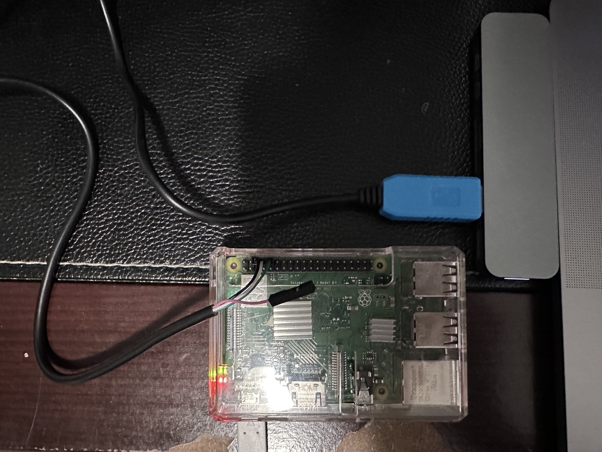

# Serial echo server over UART

This example shows how to send strings between a client (C and Python) and a server (Python) connected via a serial line.

I just used Python for the server because much of the code is identical between the client and server. The server was running on a Raspberry Pi 3B+ and I used a USB-to-TTL adapter cable. The pinout is available [here](https://www.pi4j.com/1.2/images/j8header-3b-plus.png).

The Python library used is [`pySerial`](https://pypi.org/project/pyserial/).
